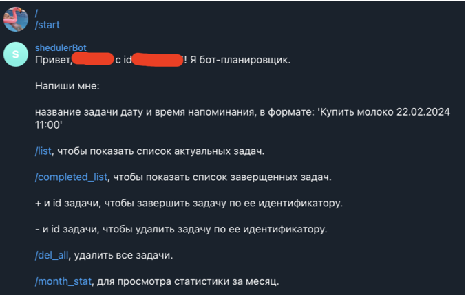
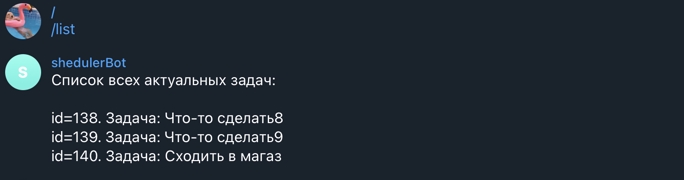
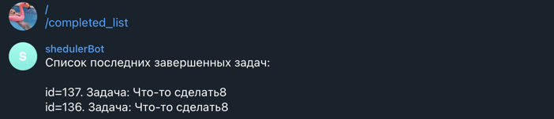

# Телеграм бот планировщик задач

## Описание

Данный бот-планировщик задач разработан на асинхронной библиотеке `aiogram` и использует `celery` для планирования напоминаний в заданные временные интервалы. `Redis` тут используется, как брокер сообщений для celery. После отправки команды `/start` бот выводит список доступных команд, которые можно использовать для работы с ботом. Пользователь может отправлять название задачи, дату и время напоминания в формате `Купить молоко 22.02.2024 11:00`. Бот сохранит данные в базу данных `SQLite` и спланирует напоминание через celery в указанное время. Кроме того, раз в сутки происходит просмотр и напоминание о просроченных задачах в заданное в Beat Scheduler время.

Доступ к боту предоставляется только одному пользователю, и аутентификация пользователя происходит через `middleware`. Если идентификатор пользователя неверен, доступ к боту закрывается. В дальнейшем благодаря использованию асинхронной библиотеки aiogram, возможно расширить функциональность бота для работы со многими пользователями.

### Зависимости
***В качестве менеджера зависимостей можно использовать poetry. Или стандарно загрузить зависимости через pip install -r requirements.txt.***
>Основные зависимости:
- Python = "3.11"
- aiogram = "^2.25.1"
- python-dotenv = "^0.21.1"
- celery = "^5.2.7"
- redis = "^4.5.1"
- flower = "^1.2.0"
- loguru = "^0.6.0"

## Взаимодействие с ботом. Команды.
- После отправки команды `/start`, бот выводит сообщение со списком доступных команд:

- Для того, чтобы добавить новую задачу, необходимо отправить сообщение с названием задачи и датой и временем напоминания в формате `"Купить молоко 22.02.2024 11:00"`. Бот сохраняет задачу в базу данных SQLite и планирует напоминание через Celery в заданное время.

- Для просмотра списка актуальных задач необходимо отправить команду `/list`.

- Для просмотра списка завершенных задач необходимо отправить команду `/completed_list`.

- Для завершения задачи по ее идентификатору необходимо отправить команду `+ и id` задачи.

- Для удаления задачи по ее идентификатору необходимо отправить команду `- и id` задачи.

- Для удаления всех задач необходимо отправить команду `/del_all`.

- Для просмотра статистики за месяц необходимо отправить команду `/month_stat`.

## Запуск
Необходимые настройки находятся в файле `config.py`. Переменные окружения задаются в файле `.env`.

Добавляем пакеты src и celery_queue системную переменную окружения PYTHONPATH, чтобы корректно работали импорты:

- `export PYTHONPATH=$PYTHONPATH:/path_to_package/src`
- `export PYTHONPATH=$PYTHONPATH:/path_to_package/celery_queue`

Точка входа - модуль `main.py`. Для запуска бота необходимо запустить `main.py`.

Для запуска обработчика задач Celery и Beat Scheduler, который будет проверять актуальность задач и отправлять напоминания, в отдельном окне терминала необходимо ввести следующую команду:

> celery -A celery_queue.tasks worker -B --loglevel=debug

Также в качестве веб-интерфейса для мониторинга и управления задачами можно использовать flower:
> celery -A celery_queue.tasks flower --broker=redis://localhost:6379/0

